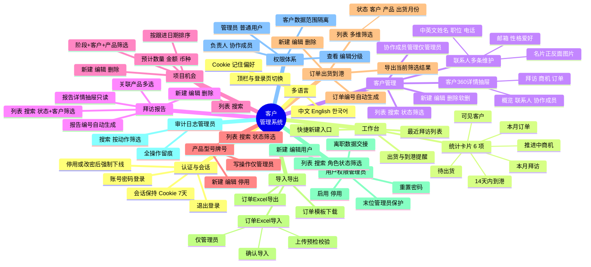

# 客户管理系统 · 功能清单

> 本文档按当前已实现的功能编写，随代码同步维护。
> 技术栈：Next.js 16 + Ant Design 6 + better-sqlite3，数据以本地 SQLite 存储。

## 功能全景

## 模块明细

### 1. 认证与会话
- 账号 + 密码登录，密码 bcrypt 加密存储。
- 登录成功后写入服务端 `sessions` 表并下发 httpOnly Cookie，默认有效期 7 天（可通过 `SESSION_DAYS` 配置）。
- 退出登录清除会话。
- 账号被停用或被重置密码后，其已有会话立即失效，需重新登录。

### 2. 工作台（Dashboard）
- 6 项实时统计卡片：可见客户、本月拜访、推进中商机、本月订单、待出货、14 天内到港。
- 快捷新建入口：一键跳转到客户 / 拜访 / 商机 / 订单的新建表单。
- 最近拜访列表（最多 6 条）。
- 出货与到港提醒列表（按预计到港日期升序）。
- 统计口径按北京时间（UTC+8）切分月份与日期。

### 3. 客户管理
- 列表支持关键词搜索（名称 / 简称 / 英文名 / 地区 / 国家 / 行业）与客户状态筛选。
- 客户名称、英文名称之外还有简称：列表、卡片副标题与客户档案页头均展示，搜索与 Excel 导入模板同样支持。
- 行业为手动输入（不走标签配置），列表的行业筛选下拉自动汇总库里已录入过的行业值。
- 新建、编辑、删除（软删除）。
- 客户 360 详情抽屉，含概览、联系人、协作成员、拜访、商机、订单等页签。
- 联系人随客户表单维护，数量不限（单个客户最多 50 位）：可逐条增删，每条含中文姓名、英文姓名、职位、联系电话、邮箱、性格爱好，以及名片正反面图片（上传时压缩后存库，客户档案页可点开看大图）。
- Excel 导入只覆盖排在最前的那位联系人（含性格爱好），名片图片仅支持在界面上传。
- 协作成员的增删由管理员在编辑时管理；成员保存时保留原有「查看 / 编辑」权限等级。

### 4. 拜访报告
- 列表支持关键词搜索（标题 / 报告编号 / 客户 / 纪要）与状态、客户筛选。
- 新建、编辑、删除。
- 必填项对齐业务规范：拜访日期、标题、客户、我方参加人员、客户方参加人员、客户公司简介、沟通纪要、后续跟进事项。
- 只读详情抽屉，完整展示沟通纪要、跟进事项等长文本；有编辑权限者可从抽屉一键转入编辑。
- 支持关联多个产品型号 / 牌号。
- 报告编号可留空自动生成。

### 5. 项目机会
- 列表支持关键词搜索，以及阶段、客户、产品三维筛选。
- 新建、编辑、删除。
- 记录预计数量、预计金额、币种、下一步动作与下次跟进日期。
- 列表按下次跟进日期优先排序，便于跟进节奏管理。

### 6. 产品型号 / 牌号
- 列表支持关键词搜索（含竞争型号与生产商）与状态筛选。
- 竞争对手对标型号随产品表单维护，数量不限（单个产品最多 100 条）：每条含竞争型号、生产商与对比备注，如「CJS700 / 广州石化」；列表列出前 3 条，其余折叠为「+N」。
- 新建、编辑、停用。
- 写操作（新建 / 编辑 / 停用）仅管理员可执行，普通用户只读。

### 7. 订单 / 出货 / 到港
- 列表支持关键词搜索，以及状态、客户、产品、出货月份多维筛选。
- 新建、编辑、删除。
- 订单编号可留空自动生成。
- 支持一键导出当前筛选结果为 Excel。

### 8. 导入导出
- 下载标准订单 Excel 模板。
- 导出权限范围内的订单为 Excel。
- 订单 Excel 导入（仅管理员）：先上传预检校验，确认无误后再正式导入。

### 9. 用户权限（仅管理员）
- 列表支持搜索与角色、状态筛选。
- 新建、编辑用户，设置角色与账号状态。
- 启用 / 停用账号（不能停用当前登录账号）。
- 重置密码。
- 离职数据交接：将某人名下的客户、商机、订单批量转移给另一名启用账号。
- 末位管理员保护：系统始终保留至少一个启用的管理员。

### 10. 审计日志（仅管理员）
- 自动记录新建、更新、删除、停用、导入、交接、重置密码、登录、退出等操作。
- 支持关键词搜索与按动作类型筛选。

## 权限矩阵

| 模块 | 普通用户 | 管理员 |
|---|---|---|
| 工作台 / 客户 / 拜访 / 商机 / 订单 | ✅ 仅本人负责或协作范围内的数据 | ✅ 全部数据 |
| 产品型号 / 牌号 | 👁 只读 | ✅ 增删改 |
| 订单导出 | ✅（权限范围内） | ✅ |
| 订单 Excel 导入 | ❌ | ✅ |
| 用户权限 | ❌ | ✅ |
| 审计日志 | ❌ | ✅ |

## 贯穿全系统的机制

- **多语言（中 / 英 / 韩）**：顶栏与登录页均可切换语言，偏好通过 Cookie 记住（刷新、重新登录后保持）；界面文案、表单校验、状态标签、日期格式与 antd 组件内置文案全部随语言切换。业务数据（客户名、纪要等）按录入原文展示。
- **数据隔离**：普通用户只能看到自己是「负责人」或「协作成员」的客户，以及挂在这些客户下的拜访 / 商机 / 订单；协作成员分「可查看 / 可编辑」两档。
- **软删除**：客户、拜访、商机、订单删除均为标记 `deleted_at`，非物理删除；产品的「删除」实为停用。
- **审计留痕**：关键写操作与登录 / 退出均自动写入审计日志。
- **时间口径**：数据库以 UTC 存储，展示与统计统一转换为北京时间（UTC+8）。
- **响应式布局**：桌面固定侧边栏，窄屏折叠为抽屉式导航。
